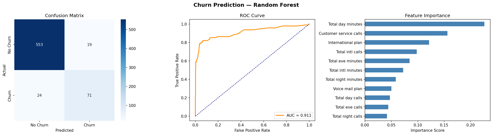

# Customer Churn Prediction

A machine learning project that predicts which telecom customers are likely to cancel their subscription — so the company can take action before they leave.

---

## The Business Problem

Every month, telecom companies lose customers who cancel their subscriptions. This is called **churn**. The challenge is that companies only find out *after* the customer has already left.

This project builds a model that identifies **at-risk customers in advance** — giving the company time to offer discounts, resolve complaints, or improve service before it's too late.

> Retaining an existing customer is **5x cheaper** than acquiring a new one.

---

## Dataset

- **Source:** [Kaggle — Telecom Churn Dataset](https://www.kaggle.com/datasets/mnassrib/telecom-churn-datasets)
- **Training data:** 2,666 customers
- **Test data:** 667 customers (completely unseen during training)
- **Features:** Customer usage patterns, plan details, and service history
- **Target:** Whether the customer churned or not

---

## What I Found in the Data (EDA)

Before building any model, I spent time understanding the data. Here are the key findings:

**Class Imbalance**
Only 14.6% of customers actually churned. This means a naive model that always predicts "no churn" would get 85% accuracy — but would be completely useless. I handled this using SMOTE.

**Duplicate Columns**
The charge columns (day charge, evening charge, etc.) are mathematically identical to the minutes columns multiplied by a fixed rate. They carry zero additional information, so I removed them.

**Redundant Features**
- `Number of voicemail messages` is always 0 when `Voice mail plan = No` — same information stored twice
- `Account length` had 0.000 correlation with churn — completely irrelevant

**Key Churn Signals Discovered**
- Customers who called customer service **4 or more times** had dramatically higher churn rates
- Customers with an **international plan** churned significantly more than those without
- **High daytime usage** (more minutes = bigger bill) was the strongest predictor of churn

## Model Comparison

| Model | F1 Score | ROC-AUC | Accuracy |
|-------|----------|---------|----------|
| Logistic Regression | 0.45 | 0.79 | 75% |
| **Random Forest** ✅ | **0.78** | **0.90** | **94%** |
| Gradient Boosting | 0.74 | 0.91 | 93% |

Random Forest delivered the best overall balance of precision and recall, with the highest F1 score. I used F1 as the primary metric because accuracy is misleading on imbalanced datasets.

---

## Final Results on Test Data

The model was evaluated on `churn-bigml-20.csv` — data it had never seen before.

| Metric | Score |
|--------|-------|
| F1 Score | 0.77 |
| ROC-AUC | 0.91 |
| Accuracy | 94% |
| Churners Correctly Identified | 71 out of 95 (74.7%) |
| False Alarms | 19 out of 572 loyal customers |

The model correctly identified nearly 75% of customers who were about to leave, with very few false alarms. The small gap between validation and test performance confirms the model generalizes well to new data.

---

## Feature Importance



| Rank | Feature | Importance | Why It Matters |
|------|---------|------------|----------------|
| 1 | Total Day Minutes | 0.23 | More usage = higher bill = higher churn risk |
| 2 | Customer Service Calls | 0.16 | Repeated complaints signal deep frustration |
| 3 | International Plan | 0.13 | Plan holders churn at a disproportionately high rate |
| 4 | Total International Calls | 0.11 | Heavy international usage without a plan causes bill shock |
| 5 | Total Evening Minutes | 0.09 | Evening usage also drives up the monthly bill |

**The story the data tells:**
High usage drives up the bill → customer calls to complain → issue goes unresolved → customer leaves. Day minutes and customer service calls together explain the majority of churn behavior.

---

## Business Recommendations

**1. Monitor high-usage customers proactively**
Customers with above-average day minutes should receive a proactive outreach — a usage alert or a better plan offer — before they see a shocking bill.

**2. Escalate repeat complaints immediately**
Any customer who has called support 3 or more times should be flagged for priority handling. Waiting for a 4th call is too late.

**3. Review the international plan**
International plan holders churn at a disproportionately high rate. The pricing or network coverage needs to be reviewed.

**4. Use the model as a monthly early warning system**
Run predictions on the full customer base every month. Share the ranked list of at-risk customers with the retention team for targeted outreach.

---

## How to Run

```bash
# 1. Clone the repository
git clone https://github.com/YOUR_USERNAME/customer-churn-prediction.git
cd customer-churn-prediction

# 2. Install dependencies
pip install pandas numpy scikit-learn imbalanced-learn matplotlib seaborn joblib

# 3. Add dataset files to the project folder
# Download from Kaggle and place here:
# → churn-bigml-80.csv
# → churn-bigml-20.csv

# 4. Run the notebook
jupyter notebook churn_prediction.ipynb
```


## Tech Stack

| Tool | Purpose |
|------|---------|
| Python | Core language |
| Pandas | Data loading and manipulation |
| Scikit-learn | Preprocessing, modeling, evaluation |
| Imbalanced-learn | SMOTE for handling class imbalance |
| Matplotlib / Seaborn | Visualizations |
| Joblib | Saving and loading the trained model |

---

## Author

M.Roman Aziz Khan
[LinkedIn](https://www.linkedin.com/in/muhammad-roman-aziz-khan-0899b732b/) • [GitHub](https://github.com/ROMAN-AZIZ-12) • 
